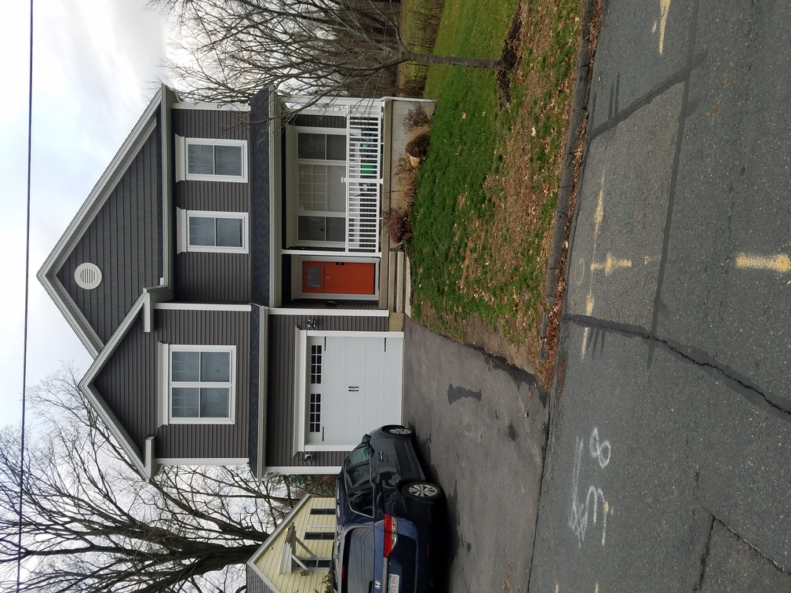
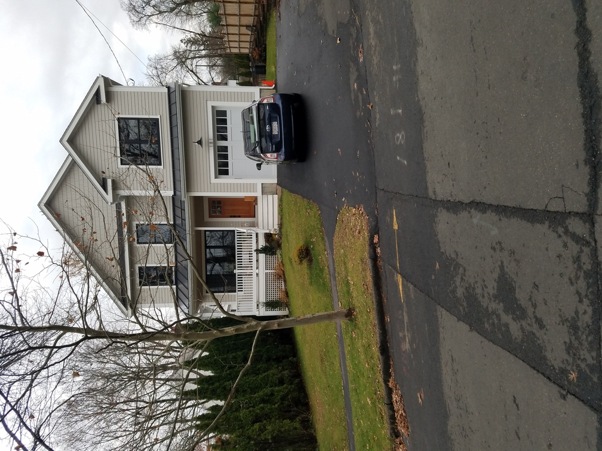
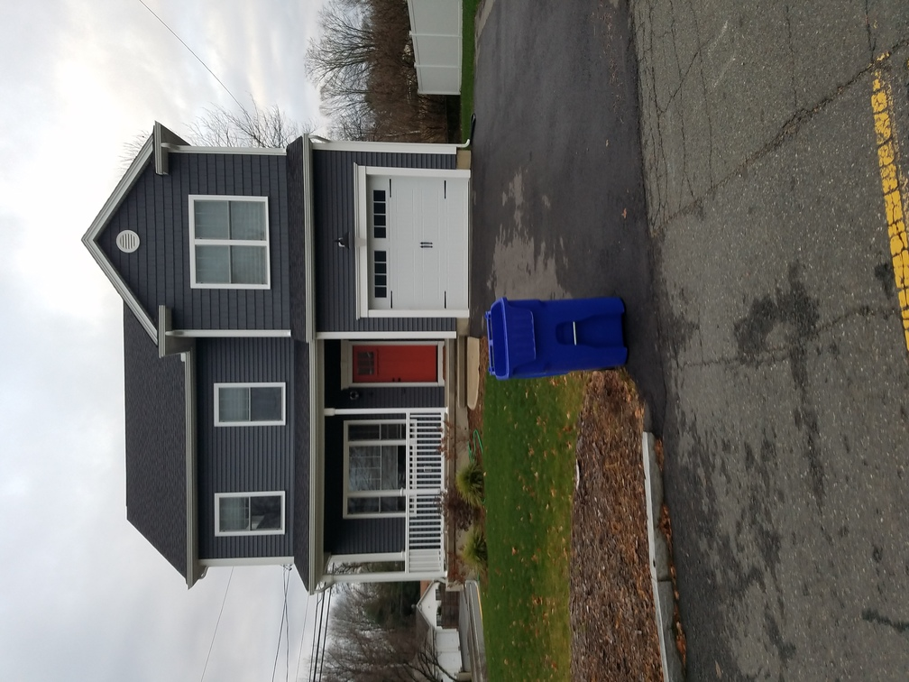
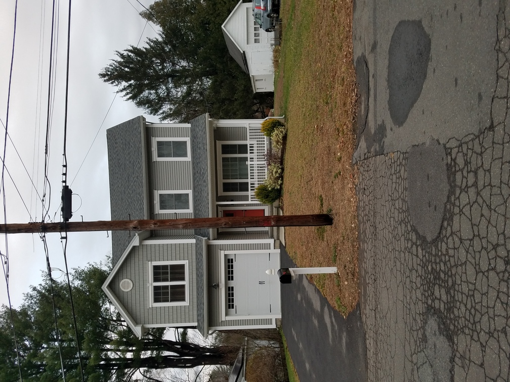
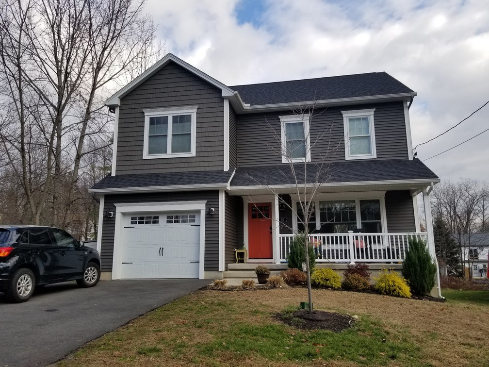
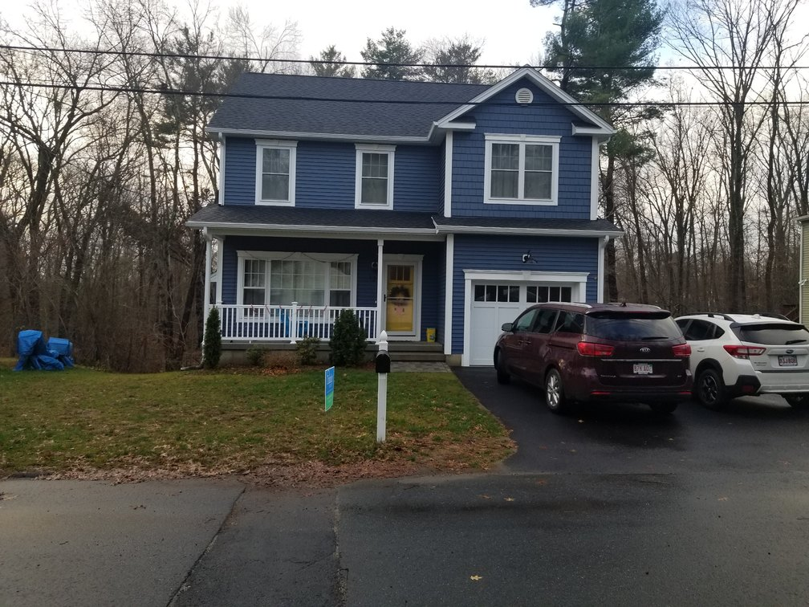

```{r, echo=FALSE}
knitr::opts_chunk$set(
  message = FALSE, 
  echo = FALSE,
  warning = FALSE,
  rows.print = 40
)
```


## Properties sold in Northampton

<div class="row">
  <div class="col-sm-4">

```{r, out.extra='angle=90'}

```

  </div>
  <div class="col-sm-8">

### [38 Stoddard St](https://www.zillow.com/homedetails/38-Stoddard-St-Northampton-MA-01060/2084411191_zpid/)

- ? bd | ? ba | ? sqft
- Paid $185,000 for lot on August 22nd, 2018
- Sold for **$610,500** on March 28th, 2019

  </div>
</div>

<hr>

<div class="row">
  <div class="col-sm-8">

### [181 Round Hill Rd](https://www.zillow.com/homes/181-round-hill-rd_rb/309911123_zpid/)

- 4 bd | 3 ba | 2,453 sqft
- Sold for **$785,000** on July 31st, 2020


  </div>
  <div class="col-sm-4">

```{r, out.extra='angle=90'}

```

  </div>
</div>

<hr>

<div class="row">
  <div class="col-sm-4">

```{r, out.extra='angle=90'}

```

  </div>
  <div class="col-sm-8">

### [4 Rust Ave / 37 Chapel St](https://www.zillow.com/homedetails/4-Rust-Ave-Northampton-MA-01060/2082525101_zpid/)

- 3 bd | 3 ba | 1,717 sqft
- Bought condemned house for $50,000 1/2/19
- Demolished existing house and built new 1,717 sq. ft house.
- Sold for **$459,000** on 12/19/19


  </div>
</div>

<hr>

<div class="row">

  <div class="col-sm-8">

### [36 Landy Ave](https://www.zillow.com/homes/36-landy-ave_rb/123115388_zpid/)

- Bought infill lot for $65,000 (adjacent house at 40 Landy Ave. was purchased by a different individual)
- Lot size 8,072 sq. ft.
- House built in 2017, 3 bd, 2.5 ba, 1,722 sq. ft.
- Sold for $420,000 Nov. 6th, 2017.
- [Current estimate on Zillow](https://www.zillow.com/homes/36-landy-ave_rb/123115388_zpid/): **$495,496**

  </div>
  <div class="col-sm-4">

```{r, out.extra='angle=90'}

```

  </div>

</div>

<hr>

<div class="row">
  <div class="col-sm-4">

```{r, out.extra='angle=90'}

```

  </div>
  <div class="col-sm-8">

### [23 Lexington Ave](https://www.zillow.com/homes/23-Lexington-Ave-Northampton,-MA,-01062_rb/2087867222_zpid/)

- Purchased 19 Lexington Ave. (900 sq. ft) & infill lot for $251,007 on November 6th, 2017
- Sold updated 19 Lexington Ave. house for $262,500 on May 21st, 2019
- Built and sold 23 Lexington Ave. for **$465,000** on November 2nd, 2018
- Built a new 2600 sq ft house next to a 900 sq ft house


  </div>
</div>

<hr>

<div class="row">

  <div class="col-sm-8">

### [12/14 Winslow Ave](https://www.zillow.com/homedetails/12-Winslow-Ave-Northampton-MA-01062/309911113_zpid/)

- Purchased house & infill lot for $337,000
- Sold 14 Winslow Ave. house for $275,000
- Sold house he built on 12 Winslow Ave. for **$523,000** May 14th, 2020


  </div>
  <div class="col-sm-4">

```{r, out.extra='angle=90'}

```

  </div>
</div>

<hr>

<div class="row">
  <div class="col-sm-4">

```{r, out.extra='angle=90'}
knitr::include_graphics("https://photos.zillowstatic.com/fp/13f39a02a31c37e981ac9a63c9994e24-cc_ft_384.jpg")
```

  </div>
  <div class="col-sm-8">

### [59 Ice Pond Dr](https://www.zillow.com/homes/59-Ice-Pond-Dr-Northampton,-MA,-01062_rb/123892070_zpid/)

- 3 bd | 3 ba | 1,923 sqft
- Bought lot for $115,000 on October 11th, 2019
- Built house and sold for **$579,000** on October 15th, 2020 


  </div>
</div>

<hr>

## Map

```{r}
library(tidyverse)
library(sf)

nu_way <- read_delim("data-raw/nu_way.tsv", delim = "\t") %>%
  mutate(date = lubridate::mdy(`Rec. Date`)) %>%
  rename(address = `Street #`)

properties <- nu_way %>%
  group_by(address) %>%
  summarize(
    n(), 
    begin = min(date),
    end = max(date)
  )

library(sf)
library(tidygeocoder)

nu_way_sf <- properties %>%
  filter(str_detect(address, "^[0-9]")) %>%
  filter(!str_detect(address, "0 ROUND HILL RD")) %>%
  mutate(lkup = paste(address, "Northampton, MA 01060")) %>%
  geocode(lkup, method = "osm") %>%
  st_as_sf(coords = c("long", "lat")) %>%
  st_set_crs(4326)
```

```{r, fig.cap="Nu-Way properties in Northampton", fig.width=9.5, fig.asp=1}
library(leaflet)
leaflet() %>%
  addTiles() %>% 
  addMarkers(data = nu_way_sf, popup = ~address)
```

## Mass Land Records data

```{r}
nu_way %>%
  select(-X1, -`Rec. Date`, -`Property Descr`) %>%
  select(date, everything()) %>%
  arrange(date)
```


## References

- [Google doc](https://docs.google.com/document/d/15OIC5T3rKYy7OcPmK5tzOjbN8xw05lpU/)
- [Mass Land Records](https://www.masslandrecords.com/Hampshire/default.aspx)